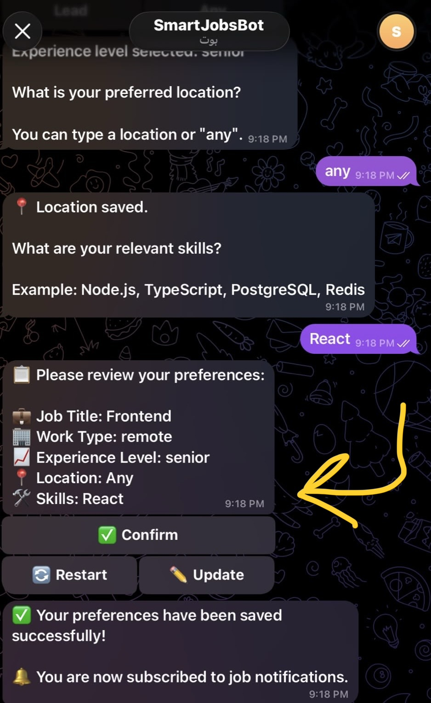
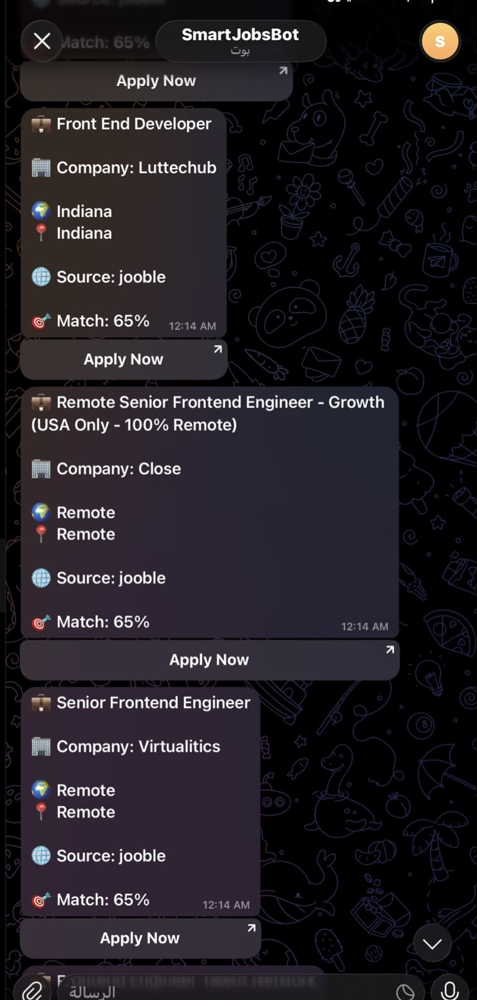

# AI Career Platform

A Telegram bot that finds job postings across 10+ free job boards, uses **Gemini AI** to score how well each job matches a user's stated preferences, deduplicates postings across sources, and pushes only the new, relevant matches to subscribers twice a day.

> **Status:** V1 — core pipeline (collection → deduplication → AI matching → Telegram delivery) is implemented and covered by an automated test suite.

**Try the live bot:** [t.me/smart_job_26_bot](https://t.me/smart_job_26_bot)

---

## Table of Contents

- [Overview](#overview)
- [Architecture](#architecture)
- [Features](#features)
- [Setup](#setup)
- [Environment Variables](#environment-variables)
- [Development](#development)
- [Testing](#testing)
- [Job Sources](#job-sources)
- [AI Matching](#ai-matching)
- [Redis](#redis)
- [GitHub Actions](#github-actions)
- [Contribution Workflow](#contribution-workflow)
- [Screenshots](#screenshots)
- [Roadmap](#roadmap)

---

## Overview

A user opens the Telegram bot, answers a few questions (desired role, work type, experience level, skills, location), and subscribes. Twice a day, the platform:

1. Collects fresh job postings from every configured source, for every subscriber's search criteria.
2. Deduplicates postings — both exact duplicates and cross-source "same job, different listing" duplicates.
3. Sends each **unique** job to Gemini once for AI analysis (role, seniority, skills, work type), caching the result so the same job is never re-analyzed.
4. Scores each job against each subscriber's preferences (AI-based, with a rule-based fallback if Gemini is unavailable).
5. Sends only jobs that clear the minimum match score **and** haven't already been sent to that user.

The pipeline can be triggered by an internal scheduler running inside the long-lived server process, by a scheduled GitHub Actions workflow hitting an authenticated HTTP endpoint, or by a standalone CLI script — see [GitHub Actions](#github-actions).

## Architecture

```
                      ┌─────────────────────┐
                      │   Telegram Bot (UI)  │  grammy
                      │  /start /subscribe   │
                      └──────────┬───────────┘
                                 │ preferences
                                 ▼
┌────────────────────────────────────────────────────────────────┐
│                        Job Pipeline (per run)                  │
│                                                                  │
│  1. Collect        JobSourceManager.fetchJobs()                 │
│     (per user)     → runs all 11 sources in parallel             │
│                     (Promise.allSettled — one source failing     │
│                      never breaks the run)                       │
│                                                                  │
│  2. Deduplicate    FingerprintService + DeduplicationService     │
│     (per user,     → composite fingerprint (title+company+URL)  │
│      then          → semantic fingerprint (title+company only)  │
│      globally)        for cross-source duplicates                │
│                     → keeps the richer-data copy of a duplicate  │
│                                                                  │
│  3. Analyze once   MatchingService.analyzeJobs()                 │
│     (global,       → each *unique* job across ALL users is       │
│      dedup'd)         analyzed by Gemini exactly once            │
│                     → result cached in Redis (7 days)            │
│                                                                  │
│  4. Match          MatchingService.matchJobs()                   │
│     (per user)      → scores cached AI analysis against each      │
│                        user's preferences (0–100)                │
│                     → falls back to keyword/rule-based scoring   │
│                        if no AI analysis is available             │
│                                                                  │
│  5. Notify         TelegramNotificationService                   │
│     (per user)      → sends jobs above MIN_MATCH_SCORE            │
│                     → skips jobs already sent to that user        │
│                        (tracked in Redis, 30-day TTL)             │
└────────────────────────────────────────────────────────────────┘
                                 │
                                 ▼
                      ┌──────────────────────┐
                      │        Redis          │  jobs, AI analyses,
                      │  (ioredis / node-redis)│  preferences, sent-log
                      └──────────────────────┘
```

**Layering** (`src/`):

| Layer | Path | Responsibility |
|---|---|---|
| Entry points | `app.ts`, `server.ts` | Express app wiring, bot startup, graceful shutdown |
| Bot | `bot/` | Telegram conversation flow (grammy), handlers, keyboards, session |
| Modules | `modules/jobs`, `modules/matching`, `modules/deduplication`, `modules/preferences`, `modules/subscriptions`, `modules/notifications` | Business logic, one module per domain concept |
| Cache | `cache/` | `Cache` interface + Redis adapter, cache keys, TTL policy |
| Config | `config/` | Env parsing, Redis client, dependency wiring (`services.ts`) |
| Shared | `shared/` | Cross-cutting error handling, middleware, logger, shared types |
| Scripts | `scripts/` | One-off/CI entry points (`run-pipeline.ts`, manual source testers) |

Dependencies are wired manually (no DI framework) in `src/config/services.ts` — this is the file to read to see how everything is connected, and where to register a new job source or swap an implementation.

## Features

- **Multi-source job collection** — 8 sources work out of the box with no API key; 3 more unlock with a free API key (see [Job Sources](#job-sources)).
- **Two-tier deduplication** — exact fingerprint + cross-source semantic fingerprint, keeping the most complete listing when duplicates are found.
- **AI-powered matching** — Gemini scores each job against role, skills, experience level, work type, and remote/location fit, with reasoning.
- **Multi-key Gemini fallback chain** — supports multiple `GEMINI_API_KEYS`, each with its own rate limiter and circuit breaker, so one exhausted key's free-tier quota doesn't stop the pipeline.
- **Rule-based fallback matching** — if Gemini is fully unavailable, jobs are still scored via keyword matching so the pipeline degrades gracefully instead of failing.
- **Analyze-once architecture** — every unique job in a run is sent to Gemini at most once, no matter how many subscribers it's relevant to.
- **Sent-job tracking** — a per-user Redis log (30-day TTL) prevents the same job from being pushed to the same user twice.
- **Telegram bot UI** — guided preference setup (`/start`), subscription management (`/subscribe`, `/unsubscribe`, `/subscription`).
- **Scheduled + on-demand delivery** — internal twice-daily scheduler, an authenticated HTTP trigger endpoint, and a standalone CLI script.
- **Health endpoint** (`GET /health`) — reports Redis connectivity, scheduler status, last pipeline run stats, and last-failed sources.
- **Dockerized** — `Dockerfile` (multi-stage) and `docker-compose.yml` (app + Redis) for local or containerized deployment.
- **CI-tested** — typecheck, lint, unit + integration tests, and a production build run on every push/PR.

## Setup

### Prerequisites

- Node.js **20+**
- A Redis instance (local, Docker, or a hosted provider)
- A Telegram bot token from [@BotFather](https://t.me/BotFather)
- A free [Google Gemini API key](https://aistudio.google.com/apikey)

### Install

```bash
git clone https://github.com/mohammedabusamra04/ai-career-platform.git
cd ai-career-platform
npm install
cp .env.example .env
# fill in .env — see Environment Variables below
```

### Run with Docker Compose (app + Redis, recommended for a quick start)

```bash
docker compose up --build
```

This starts the app on `http://localhost:3000` and a Redis container together. Set the required secrets as environment variables before running (or in a `.env` file that `docker-compose.yml` will pick up).

### Run locally (Node + your own Redis)

```bash
# start Redis however you prefer, e.g.:
docker run -p 6379:6379 redis:7-alpine

npm run dev      # ts-node/tsx dev server with watch
# or
npm run build && npm start   # compiled production build
```

Once running:
- `GET http://localhost:3000/` — liveness check
- `GET http://localhost:3000/health` — detailed status (Redis, scheduler, last pipeline run, active/failed sources)
- Message your bot on Telegram and send `/start` to configure preferences.

## Environment Variables

All variables are defined in [`.env.example`](./.env.example). Copy it to `.env` and fill in the values.

| Variable | Required | Default | Description |
|---|---|---|---|
| `PORT` | No | `3000` | HTTP server port |
| `NODE_ENV` | No | `development` | `development` / `production` / `test` |
| `TELEGRAM_BOT_TOKEN` | **Yes** | — | Bot token from BotFather. Without it, the HTTP server still runs but Telegram polling is skipped |
| `REDIS_URL` | **Yes** | `redis://localhost:6379` | Redis connection string |
| `GEMINI_API_KEY` | **Yes*** | — | Single Gemini API key (legacy/simple setup) |
| `GEMINI_API_KEYS` | No | — | Comma-separated list of Gemini keys for rotation/fallback; takes priority over `GEMINI_API_KEY` if set |
| `PIPELINE_API_SECRET` | Recommended | — | Bearer/`x-api-key` secret required to call `POST /jobs/pipeline/run`. Also read as `API_BEARER_TOKEN` by the CI workflow secret name — keep both in sync if you use the HTTP trigger |
| `JOB_RUN_TIME_1` / `JOB_RUN_TIME_2` | No | `09:00` / `18:00` | Twice-daily internal scheduler run times |
| `TIMEZONE` | No | `Asia/Gaza` | IANA timezone used to interpret the run times above |
| `ADZUNA_APP_ID` / `ADZUNA_APP_KEY` | No | — | Enables the Adzuna source ([free account](https://developer.adzuna.com/)) |
| `JOOBLE_API_KEY` | No | — | Enables the Jooble source ([free account](https://jooble.org/api/about)) |
| `FIRECRAWL_API_KEY` | No | — | Enables LinkedIn scraping via Firecrawl ([free account](https://www.firecrawl.dev/)). Preferred over `RAPIDAPI_KEY` if both are set |
| `RAPIDAPI_KEY` | No | — | Fallback: enables LinkedIn jobs via JSearch on RapidAPI, used only if `FIRECRAWL_API_KEY` is not set |
| `MIN_MATCH_SCORE` | No | `40` | Minimum AI/rule-based match score (0–100) required before a job is sent to a user |

\* At least one of `GEMINI_API_KEY` or `GEMINI_API_KEYS` is required for AI matching to run; without it the pipeline still runs and falls back to rule-based matching only.

## Development

```bash
npm run dev          # tsx watch — auto-restarts on file changes
npm run build         # compile TypeScript to dist/
npm run watch         # tsc --watch (type-check/build only, no server)
npm run typecheck      # tsc --noEmit
npm run lint          # ESLint
npm run format         # Prettier — write
npm run format:check   # Prettier — check only
```

Project conventions:
- **TypeScript, strict mode** (`tsconfig.json`) — `strict`, `noUnusedLocals`, `noUnusedParameters`, `noImplicitReturns`, `noFallthroughCasesInSwitch` are all on. `npm run typecheck` must pass.
- **ESM** — `"type": "module"` in `package.json`; internal imports use explicit `.js` extensions (TypeScript NodeNext resolution).
- **ESLint + Prettier** — run `npm run lint` and `npm run format:check` before committing; CI enforces both.
- **Manual dependency wiring** — new services get instantiated and wired together in `src/config/services.ts`, not via a DI container.

## Testing

The test suite uses **Vitest**.

```bash
npm test                # full suite (unit + integration), single run
npm run test:unit        # unit-level suites only (sources, dedup, matching, telegram, services)
npm run test:integration # integration suites (pipeline, scheduler, notifications end-to-end)
npm run test:watch       # watch mode
npm run test:coverage    # with coverage report
npm run test:ci          # verbose reporter, used in CI
```

Tests live under `tests/`, mirroring the `src/modules/` structure:

- `tests/sources/` — one test file per job source (parsing, error handling)
- `tests/deduplication/` — fingerprinting and duplicate-resolution logic
- `tests/matching/` — Gemini provider behavior and matching/scoring logic
- `tests/services/` — job collection, normalization, validation, preferences, subscriptions
- `tests/telegram/` — bot handlers and message formatting
- `tests/unit/` — cross-cutting utilities (errors, middleware, logger, cache keys, Redis adapter)
- `tests/integration/` — full pipeline runs, the scheduler, and the notification flow wired together

There's also a manual/live script for sanity-checking real source responses without going through the test suite:

```bash
npm run test:sources:live   # hits the real job source APIs/feeds, prints results
```

CI runs `typecheck`, `lint`, `test`, and `build` on every push and pull request to `main`/`master` (see [`.github/workflows/ci.yml`](./.github/workflows/ci.yml)).

## Job Sources

All sources implement a common `JobSource` interface (`fetchJobs(query): Promise<Job[]>`) and are run in parallel via `JobSourceManager`, which uses `Promise.allSettled` so one failing source never breaks a pipeline run — its failure is logged and surfaced on `/health` under `sources.failedLastRun`.

**Enabled by default (no API key needed):**

| Source | Type of postings |
|---|---|
| Arbeitnow | Tech jobs, largely remote/EU |
| Remotive | Remote jobs |
| We Work Remotely | Remote jobs (RSS feed) |
| Mostaql | Freelance jobs (Arabic/MENA) |
| Tanqeeb | MENA/Gulf job board |
| Bayt | MENA/Gulf job board |
| Wuzzuf | Egypt/MENA job board |
| Forasna | MENA job board |

**Opt-in (require a free API key — see [Environment Variables](#environment-variables)):**

| Source | Key required |
|---|---|
| Adzuna | `ADZUNA_APP_ID` + `ADZUNA_APP_KEY` |
| Jooble | `JOOBLE_API_KEY` |
| LinkedIn (via Firecrawl scraping, preferred) | `FIRECRAWL_API_KEY` |
| LinkedIn (via JSearch/RapidAPI, fallback) | `RAPIDAPI_KEY` (used only if `FIRECRAWL_API_KEY` is absent) |

Adding a new source means implementing `JobSource` in `src/modules/jobs/sources/`, exporting it from `sources/index.ts`, and registering an instance in `activeJobSources` in `src/config/services.ts` (gate it behind an env var if it needs credentials).

## AI Matching

- **Provider:** Google Gemini (`@google/genai`), currently `gemini-3.6-flash`, via `GeminiProvider` (`src/modules/matching/ai/gemini.provider.ts`).
- **Multi-key fallback:** `GEMINI_API_KEYS` accepts a comma-separated list. Each (key × model) combination becomes a "slot"; the provider tries slots in order and moves to the next one if a key is rate-limited or its daily quota is exhausted — so the pipeline degrades instead of stopping when one free-tier key runs out.
- **Rate limiting:** a per-key token-bucket limiter paces requests to stay under Gemini's free-tier RPM, rather than relying on retries after a `429`.
- **Circuit breaker:** a slot that returns a transient error (e.g. `503`) is cooled down for ~90s; a slot that hits a daily quota error is cooled down for ~12h.
- **Analyze once, match many:** `MatchingService.analyzeJobs()` sends each *globally unique* job (after deduplication, across all subscribers in that run) to Gemini exactly once and caches the structured result (`role`, `experienceLevel`, `skills`, `workType`) in Redis for 7 days. `MatchingService.matchJobs()` then scores that cached analysis against each individual user's preferences — no further AI calls.
- **Scoring:** 0–100, weighted roughly as role match (up to 35), skills overlap (up to 30), experience level (±20), and work type (15), with a short human-readable `reason` string. Only jobs at or above `MIN_MATCH_SCORE` (default 40) are sent.
- **Graceful fallback:** if no AI analysis is available for a job (all Gemini slots unavailable, or the call failed), `MatchingService` falls back to the same weighted scoring logic computed directly from keyword matching on the raw job fields, so users still receive relevant jobs during an AI outage.

## Redis

Redis is the platform's only datastore — there's no separate SQL/NoSQL database. It's accessed through a small `Cache` interface (`get`/`set`/`setIfNotExists`/`delete`) implemented by `RedisAdapter`, so the storage backend could be swapped without touching business logic.

**What's stored, and for how long** (`src/cache/cache.ttl.ts`):

| Key pattern | TTL | Purpose |
|---|---|---|
| `job:<fingerprint>` | 24h | Raw collected job data |
| `job:analysis:<fingerprint>` | 7d | Cached Gemini analysis for that job, reused across pipeline runs |
| `preferences:<userId>` | 90d | User's saved job preferences |
| `fingerprint:<fingerprint>` | 24h | Fingerprint bookkeeping |
| `user:<userId>:sent:<fingerprint>` | 30d | Marks a job as already delivered to a user, so it isn't re-sent |
| `subscription:<userId>` | — | User's subscription status |

The Redis client (`src/config/redis.ts`) is configured with TCP keep-alive and an unlimited, capped-backoff reconnect strategy so idle cloud connections don't silently drop. `connectRedis()` throws (rather than swallowing the error) if the initial connection fails, so both the server and the standalone pipeline script fail fast instead of running against a dead client.

## GitHub Actions

Three workflows live in [`.github/workflows/`](./.github/workflows/):

| Workflow | Trigger | Purpose |
|---|---|---|
| `ci.yml` | Push/PR to `main`/`master`, manual | Runs typecheck, lint, tests, and a production build on every change |
| `job-pipeline.yml` | Cron `0 6,15 * * *` (06:00 & 15:00 UTC ≈ 09:00 & 18:00 Asia/Gaza), manual | Runs `npm run pipeline:run` — a one-shot execution of the full collect → dedupe → analyze → match → notify pipeline, using repo secrets for all credentials |
| `keep-alive.yml` | Cron every 10 minutes, manual | Pings the deployed app's URL (`RENDER_APP_URL` secret) to prevent a free-tier host (e.g. Render) from spinning down |

`job-pipeline.yml` is a second, independent way to run the pipeline alongside the in-process `JobNotificationScheduler` inside `server.ts` — useful if the app is deployed on a host that sleeps between requests, since a GitHub Actions cron job runs regardless of whether the server is currently awake. If you run both the in-process scheduler and this workflow against the same deployment, make sure they're not scheduled to overlap, since Redis's sent-job tracking is what keeps duplicate sends from actually re-delivering a job — but running the collection/AI-analysis work twice still wastes API quota.

Required repository secrets for `job-pipeline.yml`: `TELEGRAM_BOT_TOKEN`, `REDIS_URL`, `GEMINI_API_KEY` (or configure the workflow to pass `GEMINI_API_KEYS` instead), and optionally `ADZUNA_APP_ID`, `ADZUNA_APP_KEY`, `JOOBLE_API_KEY`, `RAPIDAPI_KEY`, `FIRECRAWL_API_KEY`, `MIN_MATCH_SCORE`, `JOB_RUN_TIME_1`, `JOB_RUN_TIME_2`, `TIMEZONE`.

Required secret for `keep-alive.yml`: `RENDER_APP_URL`.

## Contribution Workflow

1. Fork or branch from `main`.
2. `npm install`, then make your changes.
3. Before opening a PR, make sure the full CI check passes locally:
   ```bash
   npm run typecheck
   npm run lint
   npm test
   npm run build
   ```
4. Follow the existing module boundaries — new business logic belongs in `src/modules/<domain>/`, wired up in `src/config/services.ts`; cross-cutting concerns go in `src/shared/`.
5. Add or update tests alongside any behavior change (`tests/` mirrors `src/modules/`).
6. Open a PR against `main`. CI (`ci.yml`) must pass before merge.

## Screenshots

**Preference setup flow** — guided questions, review, and confirmation:



**Matched job notifications** — sent with source and match score, plus an Apply button:



## Roadmap

Planned/likely next steps beyond V1:

- Architecture diagram as an image asset (current diagram is ASCII, embedded above).
- Additional job sources and broader regional coverage.
- Persisted analytics on match quality / delivery outcomes beyond the in-memory `lastStats` snapshot.
- Configurable per-user notification schedule (currently global `JOB_RUN_TIME_1` / `JOB_RUN_TIME_2`).
- Web dashboard, as an alternative or complement to the Telegram bot UI.
